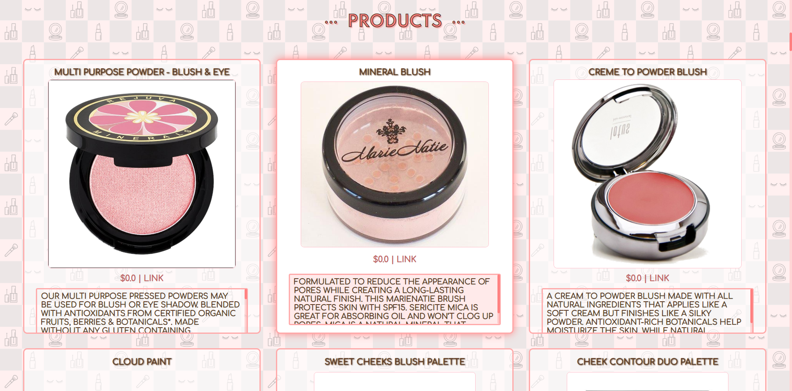

# Make-Up Your Mind 🧠
An application for make-up lovers to search and view a variety of products from different brands in addition to watching videos related to what they searched for. Users can view the products along with their preset corresponding descriptions, prices, and links to purchase them. Users may also choose to view the videos either in the window or in a new tab by clicking the respective links. 

## Motivation
I watch a lot of beauty channels on Youtube and enjoy virtual window shopping for make-up. I simply wanted to put the two together. ✌️

## Screenshots
#### Landing Page 
What users will see first. 

#### Search 
All search filters are optional.

#### Products
Selected/hovered over products and their links will exhibit a highlight.

#### Videos 
Selected/hovered over videos and their links will exhibit a highlight. 

#### Watching the Videos
Users can click the video thumbanils to display a pop-up video.

## Built With
* HTML
* CSS
* JavaScript 
* jQuery
* [Youtube Data API](https://developers.google.com/youtube/v3/getting-started)
* [Makeup API - Herokuapp](https://makeup-api.herokuapp.com/)

## Features 
* View make-up products relevant to user's search
* Open links to purchase make-up products displayed
* View videos relevant to user's search
* Watch videos that are displayed as results

## [Live Demo](https://developers.google.com/youtube/v3/getting-started)